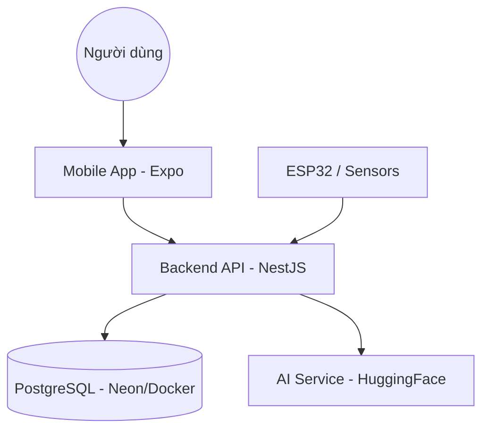

# 🏗️ Smart AC IoT - Hệ thống quản lý điều hòa thông minh

Dự án IoT production-ready giúp quản lý hệ thống điều hòa không khí thông minh, tích hợp AI để tối ưu hóa điện năng và trải nghiệm người dùng.

## 📋 Tổng quan dự án

Hệ thống bao gồm:
- **Backend**: NestJS, Prisma ORM, PostgreSQL. Tích hợp AI (HuggingFace) để đếm số người trong phòng.
- **Mobile**: React Native (Expo), Redux Toolkit. Giao diện hiện đại, hỗ trợ điều khiển thời gian thực.
- **IoT Integration**: Kết nối ESP32-CAM và các cảm biến môi trường.

## 🏗️ Kiến trúc hệ thống



---

## 🛠️ Hướng dẫn cài đặt & Chạy dự án

### 1. Yêu cầu hệ thống
- Node.js (v18+)
- PostgreSQL (Local hoặc Docker)
- Expo Go trên điện thoại (để test mobile)

### 2. Thiết lập Backend
Chuyển vào thư mục backend:
```bash
cd backend
```

**Cài đặt dependencies:**
```bash
npm install
```

**Cấu hình biến môi trường:**
Tạo file `.env` từ `.env.example` và điền các thông tin:
- `DATABASE_URL`: Đường dẫn kết nối PostgreSQL.
- `JWT_SECRET`: Khóa bí mật cho JWT.
- `HUGGINGFACE_API_KEY`: API Key từ HuggingFace (nếu dùng tính năng AI).

**Thiết lập Database (Prisma):**
```bash
npx prisma generate
npx prisma migrate dev --name init
npx prisma db seed
```

**Chạy ở chế độ phát triển:**
```bash
npm run start:dev
```

**Kiểm tra (Test):**
```bash
npm test
```

---

### 3. Thiết lập Mobile
Chuyển vào thư mục mobile:
```bash
cd mobile
```

**Cài đặt dependencies:**
```bash
npm install
```

**Chạy ứng dụng:**
```bash
npx expo start
```
- Quét mã QR bằng ứng dụng **Expo Go** trên Android/iOS.
- Nhấn `a` để chạy giả lập Android hoặc `i` cho iOS.

---

## 📦 Build & Deploy

### 🛠️ Build Production
**Backend:**
```bash
cd backend
npm run build
```
Sản phẩm build sẽ nằm trong thư mục `dist`.

**Mobile (Android/iOS):**
Sử dụng EAS Build (Yêu cầu tài khoản Expo):
```bash
eas build --platform android
```

### 🚀 Deployment (Render + Neon)
Dự án đã được cấu hình sẵn để deploy lên **Render** thông qua file `render.yaml`.

1. Đẩy code lên GitHub.
2. Truy cập [Render Dashboard](https://dashboard.render.com).
3. Chọn **New +** -> **Blueprint**.
4. Kết nối Repo và điền các biến môi trường:
   - `DATABASE_URL` (Lấy từ Neon.tech)
   - `JWT_SECRET`
   - `SENSOR_DEVICE_KEY`

Chi tiết xem tại: [DEPLOYMENT.md](./DEPLOYMENT.md)

---

## 🧪 Các lệnh hữu ích khác

| Lệnh | Mô tả |
|------|-------|
| `npm run prisma:generate` | Cập nhật Prisma Client khi sửa Schema |
| `npm run typecheck` | Kiểm tra lỗi TypeScript (Mobile) |
| `docker-compose up` | Chạy DB local qua Docker (nếu có) |

---

## 📞 Liên hệ & Hỗ trợ
Nếu có bất kỳ thắc mắc nào, vui lòng liên hệ đội ngũ phát triển.
